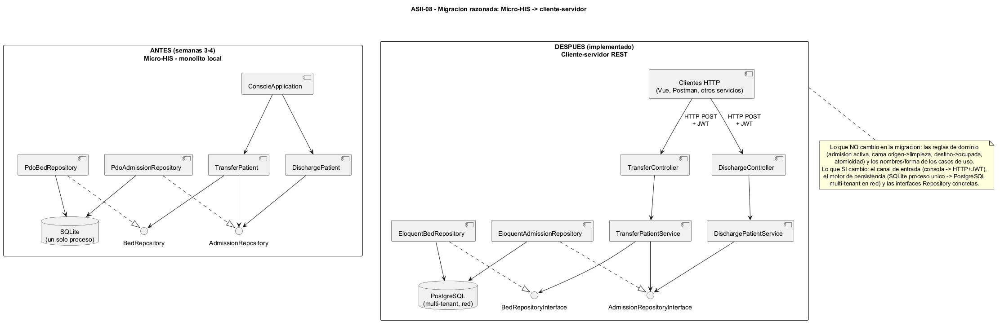
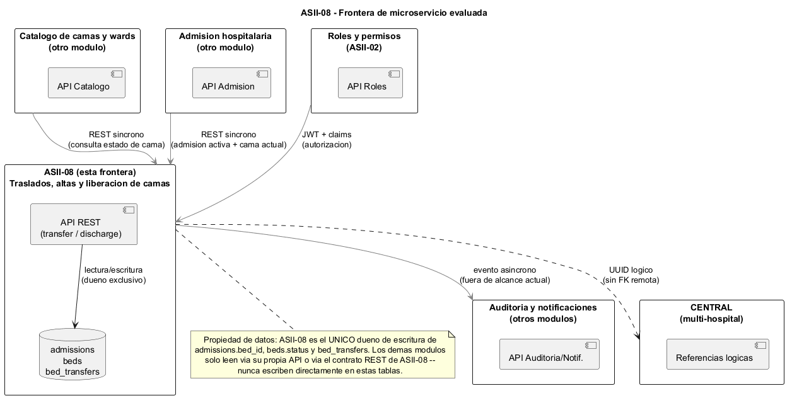

# Semana 5 — Cliente-servidor, API REST, microservicios e integración

## Módulo ASII-08: Traslados, altas y liberación de camas

## 1. Propósito

Evolucionar el mismo «Micro-HIS Traslados, altas y liberación de camas» (semanas 3-4, PHP vanilla) hacia un diseño cliente-servidor, y evaluar una frontera de microservicio para el flujo «traslado o alta del paciente con liberación consistente de cama», sin construir infraestructura de producción ni dividir el sistema sin justificación medible.

Esta migración **ya ocurrió en la práctica**: el Micro-HIS de las semanas 3-4 fue el prototipo local (consola, SQLite, un solo proceso); el backend Laravel del repositorio grupal (PR #67) es el diseño cliente-servidor evolucionado (API REST, PostgreSQL, multi-tenant). Este documento explica esa migración de forma razonada y evalúa la frontera de microservicio del módulo.

## 2. Migración razonada: de monolito local a cliente-servidor

| Aspecto | Antes (Micro-HIS, semanas 3-4) | Después (implementado) |
|---|---|---|
| Canal de entrada | Consola (`ConsoleApplication`, un usuario, un proceso) | HTTP REST + JWT (múltiples clientes concurrentes) |
| Persistencia | SQLite, archivo local, un solo proceso | PostgreSQL, red, multi-tenant |
| Aislamiento | No aplica (una sola instalación) | `tenant_id` obligatorio en cada consulta/escritura |
| Repository | `PdoAdmissionRepository`, `PdoBedRepository` (PDO directo) | `EloquentAdmissionRepository`, `EloquentBedRepository` (Eloquent) |
| Casos de uso | `TransferPatient`, `DischargePatient` | `TransferPatientService`, `DischargePatientService` |

**Lo que no cambió** (y es la evidencia de que la migración fue evolutiva, no una reescritura): las reglas de dominio (una admisión activa por traslado, cama origen → `limpieza`, cama destino → `ocupada`, atomicidad de la operación, rechazo de alta repetida) y la forma de los casos de uso. Cambió el canal de entrada y el adaptador de persistencia — exactamente los puntos que el patrón Repository (semana 4) y la separación por capas (semana 3) diseñaron para que pudieran cambiar sin tocar las reglas de negocio.

## 3. Frontera de microservicio evaluada

### 3.1 Qué posee este módulo

ASII-08 es el **único dueño de escritura** de `admissions.bed_id`, `beds.status` (en el subconjunto relevante al traslado/alta) y de la tabla `bed_transfers`. Ningún otro módulo escribe directamente sobre estas tablas — la única forma de modificarlas es a través del contrato REST de ASII-08.

### 3.2 De qué depende (lectura, no escritura)

Según la matriz de dependencias ya definida en `semana-02-requisitos-diseno-solid.md` (sección 8):

| Módulo | Qué necesita ASII-08 de él |
|---|---|
| Catálogo de salas, wards y camas | Existencia y ubicación de camas |
| Admisión hospitalaria | La admisión activa y su cama actual |
| Roles y permisos (ASII-02) | Autorización — quién puede trasladar/dar de alta |
| Multitenancy | Aislamiento de `tenant_id` |
| Gobernanza y auditoría / Notificaciones | Consumen eventos de ASII-08 — no lo bloquean |

### 3.3 Justificación medible para (no) dividir

**No se justifica separar ASII-08 como servicio desplegado de forma independiente todavía**, porque:

1. El acoplamiento real hacia otros módulos ya es bajo (solo lecturas vía API/roles, cero llaves foráneas hacia otros módulos, aislamiento por tenant ya aplicado) — separar el despliegue no reduciría acoplamiento de código, solo agregaría latencia de red y un punto de falla adicional entre módulos que hoy comparten el mismo proceso.
2. No existe evidencia de carga o escalamiento diferencial que justifique escalar ASII-08 de forma independiente al resto del sistema.
3. El costo de operar un servicio adicional (despliegue, observabilidad, descubrimiento de servicios) no tiene, por ahora, un beneficio medible que lo compense.

**La frontera lógica ya está lista para una futura separación física** si alguna de esas condiciones cambia: el módulo ya expone su único punto de entrada por REST, ya no tiene dependencias de escritura cruzada, y su persistencia (`admissions`, `beds`, `bed_transfers`) es local a su propio dominio.

## 4. Contrato API

| Endpoint | Entrada | Salida éxito | Salida error |
|---|---|---|---|
| `POST /api/v1/admissions/{admissionId}/transfer` | `destination_bed_id` (int, requerido), `reason` (string, opcional) | `200 {"message": "Paciente trasladado correctamente."}` | `422 {"message": "<motivo>"}` |
| `POST /api/v1/admissions/{admissionId}/discharge` | `discharge_type` (`voluntaria`\|`medica`\|`fallecimiento`\|`traslado`, requerido), `notes` (string, opcional) | `200 {"message": "Paciente dado de alta correctamente."}` | `422 {"message": "<motivo>"}` |

(Detalle completo de validación en `semana-07-componentes-refactorizacion.md`, sección 3.1.)

## 5. Propiedad de datos

Se respeta la separación federada ya definida en `ESPECIFICACION.md` (sección 8):

- **HOSPITAL:** `admissions`, `beds`, `wards`, `bed_transfers` son escritura clínica/local — propiedad exclusiva de ASII-08 dentro de su tenant.
- **CENTRAL:** cualquier referencia hacia componentes centrales (multi-hospital) se maneja como **UUID lógico**, nunca como llave foránea remota.
- Esto permite que ASII-08 siga operando aunque la conectividad con CENTRAL falle — el traslado/alta local no depende de una escritura remota.

## 6. Comunicación

- **Entrante (síncrona):** HTTP REST + JWT, un request-response por operación. Es el único canal soportado hoy; no hay colas ni gRPC.
- **Saliente hacia auditoría/notificaciones:** debería ser **asíncrona por evento** (ej. "traslado confirmado", "alta confirmada") para no acoplar la transacción principal a un tercero — esto está **fuera del alcance actual** (ver `ESPECIFICACION.md`, sección 2, "Notificaciones" explícitamente excluida de esta vertical) y queda identificado aquí como el siguiente punto de integración, no como algo ya construido.

## 7. Seguridad

Sin cambios respecto a lo ya implementado y validado: middleware `tenant` + `jwt.auth` + `role` antes de llegar al controlador; el `tenant_id` se toma del contexto autenticado, nunca de un parámetro enviado por el cliente (`ADR-001-arquitectura.md`, sección 4.7).

## 8. Resiliencia

- **Dentro de la transacción:** ya cubierta por `TransactionManagerInterface`/`LaravelTransactionManager` — un fallo interno revierte cama origen, cama destino, admisión y `bed_transfers` como una unidad (`ADR-001`, sección 4.5).
- **Frente a clientes que llaman al servicio:** el traslado y el alta son operaciones que **rechazan repetición** por diseño (RB-06, RF-08) — un cliente que reintenta una operación ya confirmada recibe `422`, no un efecto duplicado. Esto le da al cliente una forma segura de reintentar ante un timeout de red sin arriesgar un traslado doble.
- **Pendiente, no construido:** timeouts explícitos y backoff del lado del cliente, y un circuit breaker si en el futuro ASII-08 pasara a ser un servicio desplegado aparte — no aplica mientras el sistema sea un monolito desplegado como una sola unidad.

## 9. Observabilidad

- **Lo que ya existe:** `bed_transfers` funciona como registro de auditoría parcial (quién autorizó, cuándo, cama origen/destino) — es trazabilidad de negocio, no observabilidad técnica.
- **Lo que falta (identificado, no construido en esta vertical):** logging estructurado por request, métricas de latencia/tasa de error por endpoint, y trazabilidad distribuida si el sistema llegara a dividirse en servicios reales. Se deja como brecha conocida, consistente con que el módulo "puede entregar diseño/prototipo" en esta semana, no observabilidad de producción.

## 10. Consistencia

- **Interna:** consistencia fuerte, transaccional (PostgreSQL, `ADR-001` sección 4.6, criterio de aceptación CA-05 de `ESPECIFICACION.md`).
- **Hacia CENTRAL:** consistencia eventual por diseño — las referencias son UUID lógicos, no hay transacción distribuida (`ESPECIFICACION.md`, sección 8). Es una decisión explícita, no una limitación no evaluada: una transacción distribuida entre HOSPITAL y CENTRAL fue considerada y descartada en `ADR-001`, Alternativa E.

## 11. Plan de issue, rama, worktree y PR

Siguiendo el mismo flujo ya usado para las semanas 6 y 7 de este módulo:

- **Issue:** "ASII-08: documentar evolución cliente-servidor y frontera de microservicio (semana 5)".
- **Rama:** `feature/asii-08-traslados-altas-liberacion-camas-00abimendoza` (la misma rama activa del módulo — este es un entregable de diseño, no requiere una rama nueva).
- **Worktree:** el checkout local del módulo ya opera como *git worktree* (`sistema-hospitalario-esau`, enlazado a `sistema-hospitalario-main`) — no se necesita uno adicional para un entregable de documentación.
- **Pull Request:** se integra al mismo PR #67 (abierto contra `develop`, sin mergear hasta revisión del ingeniero), agregando este documento y sus diagramas a `docs/modules/asii-08/`.

## 12. Conclusión

La migración de Micro-HIS a un diseño cliente-servidor ya está implementada y puede explicarse de forma trazable: lo que cambió fue el canal de entrada y el adaptador de persistencia; lo que se mantuvo fueron las reglas de dominio, gracias a la separación por capas y al patrón Repository ya adoptados en las semanas 3 y 4. La frontera de microservicio del módulo está bien definida (propiedad exclusiva de sus tablas, dependencias solo de lectura, aislamiento por tenant), pero no se justifica separarlo como servicio desplegado independiente sin evidencia medible de carga o escalamiento diferencial — esa es la decisión documentada, no una omisión.
