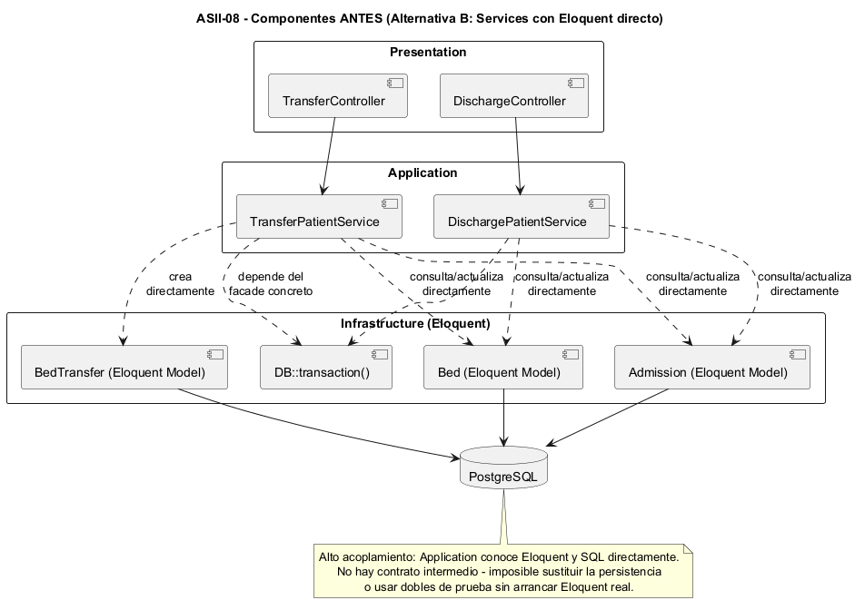
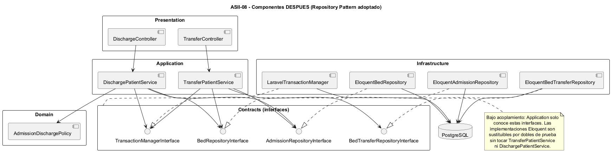

# Semana 7 — Diseño de componentes y refactorización

## Módulo ASII-08: Traslados, altas y liberación de camas

## 1. Propósito

Diseñar los componentes backend propios de «traslado o alta del paciente con liberación consistente de cama» y refactorizar conceptualmente el punto con mayor acoplamiento del módulo, separando UI, aplicación, dominio y persistencia sin ampliar el alcance ya definido en `ESPECIFICACION.md` y `ADR-001-arquitectura.md`.

## 2. Diagrama de componentes

### 2.1 Antes — servicios acoplados directamente a Eloquent



`TransferPatientService` y `DischargePatientService` consultan y actualizan los modelos Eloquent (`Admission`, `Bed`, `BedTransfer`) directamente, y dependen del facade concreto `DB::transaction()`. No existe un contrato intermedio entre Application e Infrastructure.

### 2.2 Después — Repository Pattern adoptado (implementado)



`TransferPatientService` y `DischargePatientService` dependen únicamente de las interfaces del paquete `Contracts`: `AdmissionRepositoryInterface`, `BedRepositoryInterface`, `BedTransferRepositoryInterface` y `TransactionManagerInterface`. Las clases `Eloquent*Repository` y `LaravelTransactionManager` implementan esos contratos en la capa Infrastructure. `DischargePatientService` además depende de `AdmissionDischargePolicy` (Domain), independiente de HTTP y de Eloquent.

## 3. Contratos de entrada/salida

### 3.1 API (Presentation)

| Endpoint | Entrada | Salida éxito | Salida error |
|---|---|---|---|
| `POST /api/v1/admissions/{admissionId}/transfer` | `destination_bed_id` (int, requerido), `reason` (string, opcional, máx. 1000) | `200` `{"message": "Paciente trasladado correctamente."}` | `422` `{"message": "<motivo del rechazo>"}` |
| `POST /api/v1/admissions/{admissionId}/discharge` | `discharge_type` (`voluntaria`\|`medica`\|`fallecimiento`\|`traslado`, requerido), `notes` (string, opcional, máx. 2000) | `200` `{"message": "Paciente dado de alta correctamente."}` | `422` `{"message": "<motivo del rechazo>"}` |

Ambos endpoints exigen middleware `tenant` + `jwt.auth` + `role` antes de llegar al controlador; el `tenant_id` se obtiene del contexto autenticado (`$request->attributes->get('tenant')`), nunca de un parámetro del cliente.

### 3.2 Contratos internos (Application ↔ Infrastructure)

```php
interface AdmissionRepositoryInterface {
    public function findActiveByIdForTenant(int $id, string $tenantId): ?Admission;
    public function updateBed(int $admissionId, string $tenantId, int $bedId): void;
    public function discharge(int $admissionId, string $tenantId, string $type, ?string $notes = null): void;
}

interface BedRepositoryInterface {
    public function findByIdForTenant(int $id, string $tenantId): ?Bed;
    public function updateStatus(int $id, string $tenantId, string $status): void;
}

interface BedTransferRepositoryInterface {
    public function create(array $data): BedTransfer;
}

interface TransactionManagerInterface {
    public function run(callable $callback): mixed;
}
```

Estas cuatro interfaces son el contrato de entrada/salida real entre Application e Infrastructure: cada método define exactamente qué entra (tipos escalares o modelos) y qué sale (modelo, `void`, o `mixed` en el caso de `run()`, que retorna lo que el callback produzca).

## 4. Refactor concreto: el punto de mayor acoplamiento

**Punto identificado:** la dependencia directa de `TransferPatientService`/`DischargePatientService` hacia los modelos Eloquent y hacia `DB::transaction()` — es el punto donde traslados, altas, ocupación de camas y liberación atómica convergen sobre la misma tecnología de persistencia sin ningún contrato intermedio.

Este refactor ya fue evaluado y decidido en `ADR-001-arquitectura.md` (sección 5, "Alternativa B — Servicios usando Eloquent directamente sin Repository") **antes** de implementar el módulo, no después — por eso el estado actual del repositorio ya refleja el "después".

### 4.1 Comparación

| Aspecto | Antes (Alternativa B, rechazada) | Después (implementado) |
|---|---|---|
| Dependencia de Application | Modelos Eloquent + `DB::transaction()` concreto | 4 interfaces (`*RepositoryInterface`, `TransactionManagerInterface`) |
| Acoplamiento a tecnología | Alto — Application "sabe" que existe Eloquent/SQL | Ninguno — Application no importa Eloquent |
| Pruebas de aplicación | Requieren base de datos real o mocks de Eloquent | Dobles simples de las 4 interfaces, sin base de datos |
| Sustituir la persistencia | Reescribir los servicios | Solo agregar una nueva implementación de la interfaz |
| Atomicidad | Cada servicio decide cómo transaccionar | `TransactionManagerInterface` centraliza el contrato transaccional |

### 4.2 Justificación (de `ADR-001`, sección 5)

La Alternativa B se descartó porque:

- los casos de uso quedarían acoplados a la tecnología de persistencia;
- sería más difícil sustituir Eloquent por dobles de prueba con un contrato observable equivalente;
- disminuiría la claridad del límite entre Application e Infrastructure;
- el patrón Repository es un requisito arquitectónico relevante de la actividad (semana 2, sección 9.2 — Dependency Inversion Principle).

El costo aceptado a cambio (más clases e interfaces, necesidad de registrar bindings) se documenta en `ADR-001`, sección 7, y se considera aceptable para el alcance académico del módulo porque permite demostrar separación de responsabilidades, inversión de dependencias, pruebas aisladas y transacciones — exactamente lo que valida `TransferPatientServiceTest.php` y `DischargePatientServiceTest.php` sustituyendo las 4 interfaces por dobles, sin conexión real a PostgreSQL.

## 5. Conclusión

El componente de mayor acoplamiento del módulo (Application → Eloquent) ya fue identificado y refactorizado durante el diseño inicial mediante el patrón Repository, no como un cambio posterior. Este documento deja registro explícito del diagrama de componentes resultante, sus contratos de entrada/salida reales, y la comparación antes/después con la justificación ya validada en `ADR-001-arquitectura.md`.
