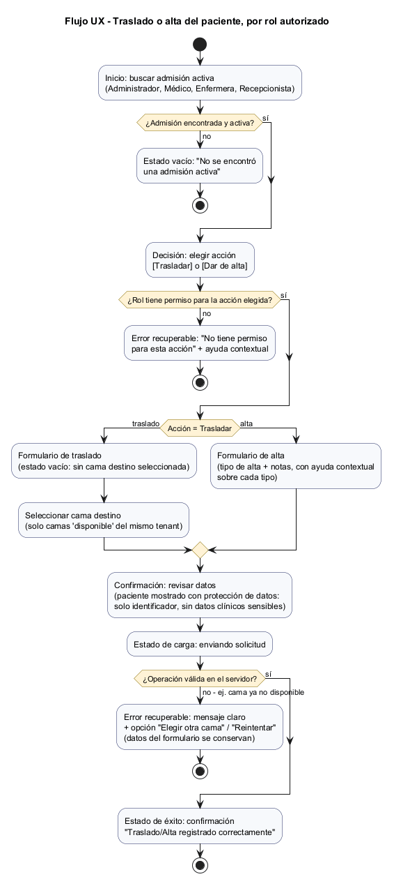
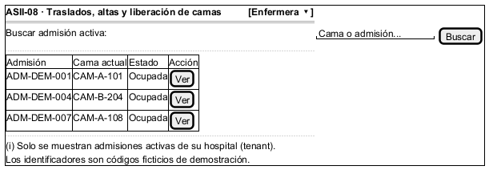
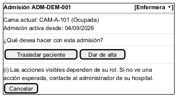
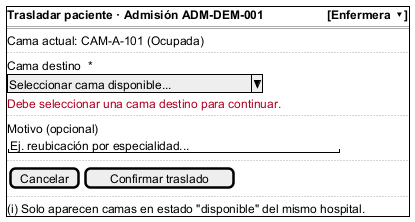
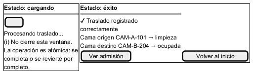
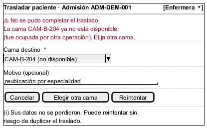
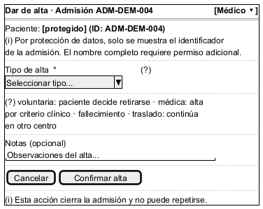

# Semana 8 — Diseño de experiencia de usuario

## Módulo ASII-08: Traslados, altas y liberación de camas

## 1. Propósito

Diseñar el flujo UX de «traslado o alta del paciente con liberación consistente de cama» para los roles autorizados (Administrador, Médico, Enfermera, Recepcionista — `ESPECIFICACION.md`, sección 3), cubriendo inicio, decisión, confirmación, estados vacío/carga/éxito, errores recuperables, ayuda contextual y protección de datos vinculados con traslados, altas, ocupación y liberación atómica de camas.

Este diseño es **de interfaz**, no de implementación: no se construyó frontend Vue real, son wireframes anotados que reflejan exactamente las reglas ya validadas en el backend (`ESPECIFICACION.md`, `ADR-001-arquitectura.md`) — cada estado de pantalla corresponde a una regla de negocio o criterio de aceptación real, no a una suposición de diseño.

## 2. User flow por rol

El flujo es el mismo para los 4 roles autorizados; lo que cambia por rol es el resultado de la validación de permiso (paso "¿Rol tiene permiso para la acción elegida?"), consistente con RF-09 (autorización por middleware `role`) y con la tabla de actores de `ESPECIFICACION.md`. El flujo cubre explícitamente:

- **Inicio** — búsqueda de admisión activa.
- **Decisión** — elegir traslado o alta, con verificación de permiso por rol.
- **Confirmación** — revisión de datos antes de enviar.
- **Estados vacío / carga / éxito** — sin admisión encontrada, envío en curso, y confirmación final.
- **Errores recuperables** — permiso denegado y cama destino no disponible, ambos sin pérdida de datos capturados.

## 3. Wireframes anotados

### 3.1 Inicio — buscar admisión activa

Lista solo admisiones del tenant del usuario autenticado (RNF-02, aislamiento por tenant). Los identificadores son códigos ficticios, consistente con RNF-10 de `semana-02-requisitos-diseno-solid.md`.

### 3.2 Decisión — elegir acción

Los botones de acción reflejan lo que el rol puede hacer; el mensaje de ayuda contextual explica qué hacer si una acción esperada no aparece, en vez de fallar en silencio.

### 3.3 Formulario de traslado — estado vacío

Estado vacío explícito: el formulario no permite confirmar sin una cama destino seleccionada (RF-03, RB-02/RB-03). El selector solo lista camas en estado `disponible` del mismo tenant.

### 3.4 Estados de carga y éxito

El estado de carga advierte explícitamente que la operación es atómica (RF-04) — el usuario no debe interpretar la espera como un fallo. El estado de éxito muestra el resultado real de la transacción (cama origen → `limpieza`, cama destino → `ocupada`), no un mensaje genérico.

### 3.5 Error recuperable — cama destino ya no disponible

Corresponde directamente a CA-02 (`ESPECIFICACION.md`): si la cama destino deja de estar disponible entre la validación inicial y la confirmación, la operación se rechaza sin ejecutar la transacción. El wireframe conserva los datos ya ingresados por el usuario y ofrece una salida clara (elegir otra cama / reintentar) en vez de forzar a reiniciar el formulario.

### 3.6 Formulario de alta — ayuda contextual y protección de datos

Dos requisitos cubiertos en una sola pantalla:

- **Ayuda contextual:** el ícono `(?)` junto a "Tipo de alta" expande la explicación de cada uno de los 4 tipos válidos (RB-08: `voluntaria`, `medica`, `fallecimiento`, `traslado`), evitando que el usuario adivine el significado.
- **Protección de datos:** el paciente se identifica solo por el código de admisión, no por nombre completo — mostrar información clínica identificable requeriría un permiso adicional, coherente con RNF-10 (datos de prueba seguros) y con el principio de exponer solo lo necesario para completar la tarea.

## 4. Cobertura de requisitos de la tarea

| Elemento pedido | Dónde está cubierto |
|---|---|
| Inicio | Flujo UX (paso inicial) + W1 |
| Decisión | Flujo UX + W2 |
| Confirmación | Flujo UX (paso "Confirmación") |
| Estado vacío | Flujo UX ("No se encontró admisión activa") + W3 |
| Estado de carga | Flujo UX + W4 |
| Estado de éxito | Flujo UX + W4 |
| Errores recuperables | Flujo UX (permiso denegado, cama no disponible) + W5 |
| Ayuda contextual | W2 (nota de permisos), W6 (tipos de alta) |
| Protección de datos | W1 (solo identificadores), W6 (paciente protegido) |

## 5. Conclusión

El diseño UX no introduce reglas nuevas: cada pantalla y cada estado (vacío, carga, éxito, error) refleja un requisito funcional, una regla de negocio o un criterio de aceptación ya validado en el backend del módulo. Esto mantiene la consistencia entre lo que el usuario ve y lo que el sistema realmente garantiza — un traslado o alta nunca se presenta como exitoso en la interfaz sin que la transacción atómica correspondiente se haya completado en el servidor.
