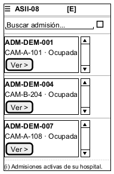
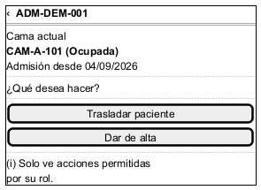
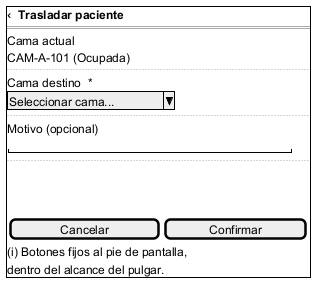
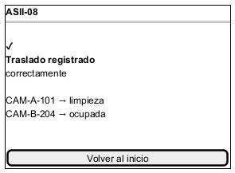
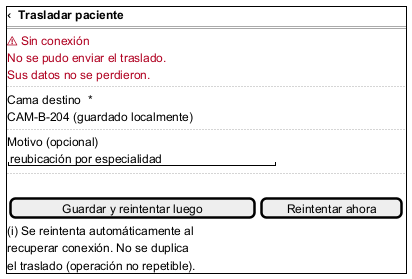

# Semana 10 — Diseño para movilidad

## Módulo ASII-08: Traslados, altas y liberación de camas

## 1. Propósito

Adaptar «traslado o alta del paciente con liberación consistente de cama» a móvil (320–430 px): jerarquizar datos y acciones, reducir carga cognitiva, y definir navegación, tablas/formularios, confirmaciones y recuperación ante conexión limitada.

Esta propuesta parte directamente del flujo y los wireframes de escritorio de `semana-08-diseno-ux.md`, e incorpora el hallazgo H6 de `semana-09-usabilidad-accesibilidad.md` (falta de confirmación antes de un alta irreversible) — la versión móvil ya lo resuelve desde el diseño, no lo repite como pendiente.

## 2. Propuesta responsive (5 pantallas)

### M1 — Inicio

La tabla de escritorio (W1) se reemplaza por **tarjetas apiladas**: a 320–430px una tabla con 4 columnas no cabe sin scroll horizontal, que es exactamente lo que se busca evitar. Cada tarjeta muestra solo lo esencial para decidir si es la admisión correcta: código, cama, estado.

### M2 — Decisión

Los dos botones de acción (lado a lado en W2, de escritorio) pasan a **apilados de ancho completo** — objetivo táctil mínimo de 44×44px por fila, sin depender de precisión de mouse.

### M3 — Formulario de traslado

Un solo campo por fila (columna única). Los botones de acción quedan **fijos al pie de la pantalla**, dentro del alcance natural del pulgar — no al final de un formulario que puede requerir scroll.

### M4 — Confirmación / éxito

Igual que en escritorio (W4): el resultado real de la transacción (cama origen → `limpieza`, cama destino → `ocupada`), no un mensaje genérico — la jerarquía de contenido no cambia entre dispositivos, solo el layout.

### M5 — Error de conexión limitada

Pantalla específica para el escenario de red inestable, ver sección 4.2.

## 3. Reglas de breakpoint

| Regla | 320–430px (móvil, este entregable) | > 430px (tablet/escritorio, semana 8) |
|---|---|---|
| Listado de admisiones | Tarjetas apiladas, 1 columna | Tabla con columnas Admisión / Cama / Estado / Acción |
| Acciones de decisión | Botones apilados, ancho completo | Botones lado a lado |
| Formularios | 1 campo por fila, ancho completo | Puede usar 2 columnas |
| Botones de confirmación | Fijos al pie de pantalla (`position: sticky`) | En flujo normal del formulario |
| Navegación | Botón "‹" de regreso explícito (sin barra lateral) | Header con navegación completa |
| Tipografía mínima | 16px en campos de formulario (evita zoom automático en iOS) | 14–16px |
| Objetivo táctil mínimo | 44×44px por elemento interactivo | Sin mínimo forzado (mouse) |

Rango 320–430px elegido porque cubre desde un dispositivo angosto de referencia (320px, ej. iPhone SE) hasta uno ancho (430px, ej. gama alta) sin pasos intermedios — el diseño de una columna funciona en todo el rango sin reglas adicionales.

## 4. Dos escenarios móviles

### 4.1 Escenario — traslado exitoso en movilidad

**Decisión de contenido:** en la pantalla de inicio (M1) se prioriza el código de admisión y la cama sobre cualquier otro dato (fecha de ingreso, personal asignado, etc.) porque es lo mínimo necesario para que el usuario identifique la admisión correcta con una sola mirada, sin necesidad de abrir el detalle. Los datos secundarios se muestran solo en M2, ya con la admisión seleccionada.

**Flujo:** M1 → M2 → M3 → (carga) → M4. Coincide exactamente con el flujo de escritorio de la semana 8; lo único que cambia es el layout, no la lógica ni el número de pasos.

### 4.2 Escenario — conexión limitada durante un traslado

**Decisión de contenido y error:** si la solicitud de traslado no puede enviarse por falta de conexión, la pantalla (M5):

1. Comunica el problema de forma inmediata y honesta ("Sin conexión"), no un error genérico.
2. Confirma explícitamente que **los datos no se perdieron** — el motivo y la cama seleccionada quedan guardados localmente, visibles en pantalla.
3. Ofrece dos salidas: reintentar de inmediato, o guardar y reintentar automáticamente cuando vuelva la conexión — sin obligar al usuario a quedarse esperando.
4. Deja explícito que el traslado **no se duplica** al reintentar — consistente con RF-08/RB-06 (la operación no es repetible), así que un reintento después de que el primer intento sí llegó al servidor simplemente resulta en el mismo `422` ya conocido, no en un traslado doble.

Este escenario es el que más valor le da a la movilidad real: el personal de traslados/altas se mueve por el hospital, donde la señal Wi-Fi no siempre es estable — diseñar para conexión intermitente no es un extra, es el caso de uso principal de tener esto en móvil.

## 5. Conclusión

El diseño para movilidad no reinterpreta el flujo ya validado en la semana 8 — lo reorganiza para una pantalla angosta y agrega explícitamente lo que el escritorio no necesitaba: recuperación ante conexión limitada, que es la condición real de trabajo de quien usa un teléfono dentro de un hospital en movimiento.
