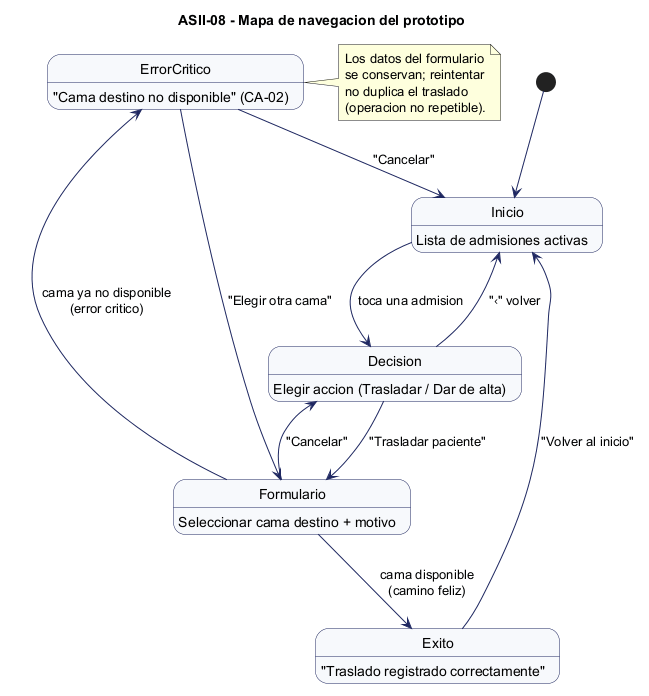
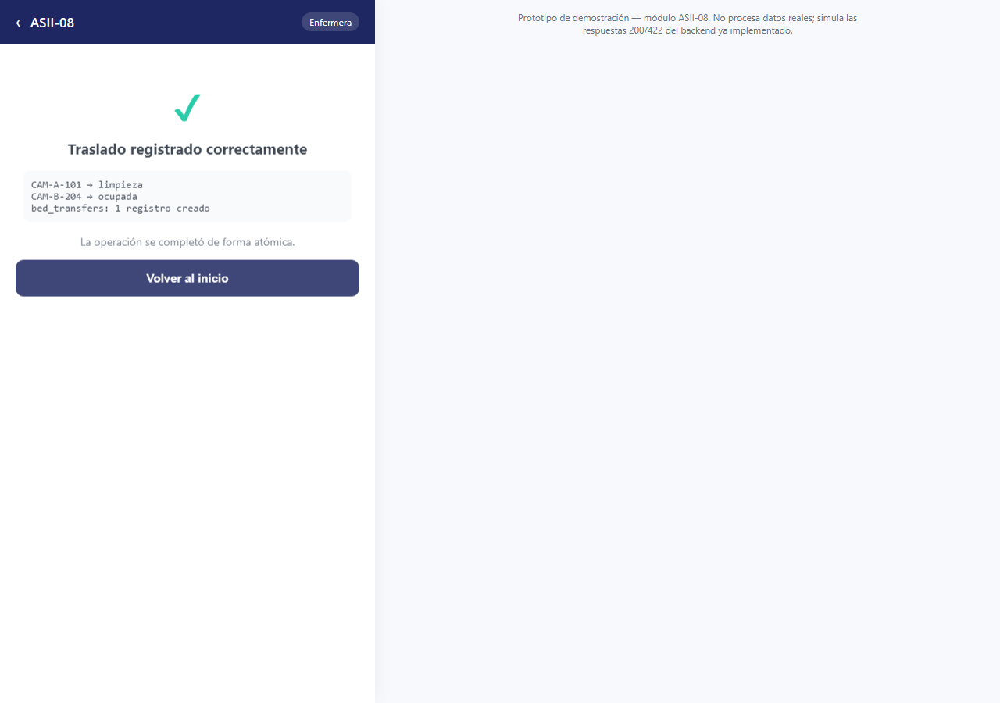
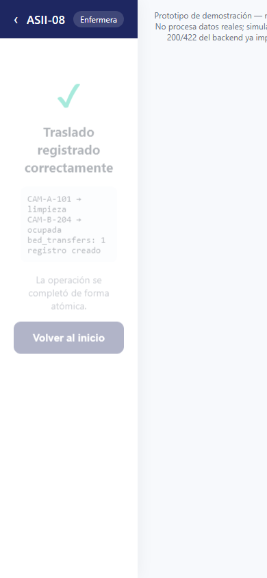
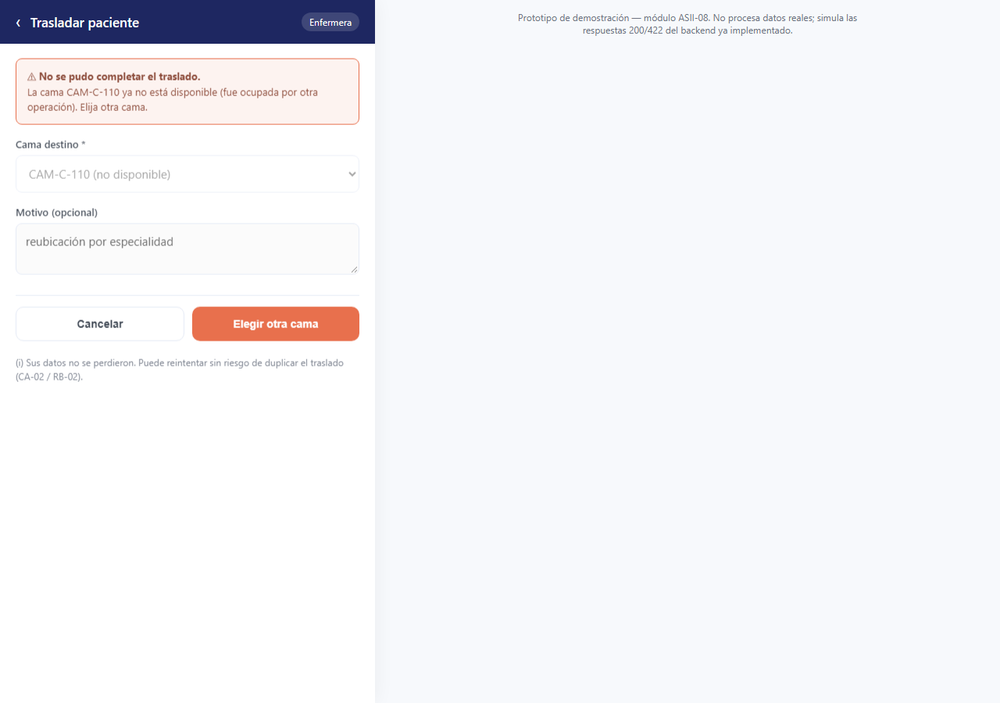
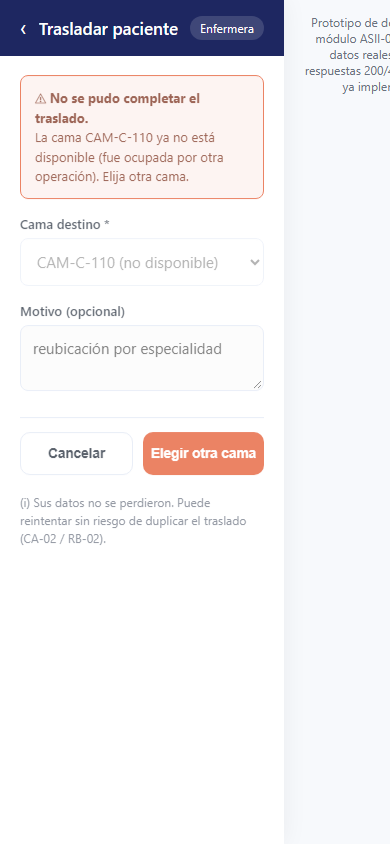

# Semana 11 — Mejores prácticas para diseño móvil/web

## Módulo ASII-08: Traslados, altas y liberación de camas

## 1. Propósito

Construir un prototipo navegable desktop y móvil del flujo principal de «traslado o alta del paciente con liberación consistente de cama», cubriendo el camino feliz y un error crítico, manteniendo consistencia de roles, estados y accesibilidad con las semanas 8 (UX), 9 (usabilidad) y 10 (movilidad).

## 2. El prototipo

**Archivo:** [`prototipo.html`](prototipo.html) — HTML/CSS/JS autocontenido, sin dependencias externas. Se abre directamente en cualquier navegador, sin instalar nada.

Es **realmente navegable** (no una serie de imágenes): toca una admisión, elige una acción, llena el formulario y confirma — la navegación entre pantallas ocurre en el propio archivo. Un mismo diseño responsive sirve para desktop y móvil (mismo mecanismo de layout definido en `semana-10-diseno-movilidad.md`); las capturas de ambos se tomaron del mismo archivo, cambiando solo el ancho del viewport.

Para generar las capturas de este documento de forma reproducible, el prototipo acepta un parámetro opcional `?demo=exito` / `?demo=error` que salta directo a ese estado — es solo para documentación, no forma parte de la interacción real (que siempre inicia en la lista de admisiones).

## 3. Mapa de navegación

5 pantallas, 2 desenlaces posibles desde el formulario (éxito o error crítico), y retorno consistente al inicio desde cualquier punto vía "Cancelar" o "Volver al inicio" — nunca se llega a un estado sin salida.

## 4. Capturas — camino feliz (cama destino disponible)

| Desktop | Móvil (390px) |
|---|---|
|  |  |

El resultado mostrado es el real de la transacción atómica (`CAM-A-101 → limpieza`, `CAM-B-204 → ocupada`, `bed_transfers: 1 registro creado`), consistente con `TransferPatientServiceTest.php` y con el wireframe W4/M4 de las semanas 8 y 10.

## 5. Capturas — error crítico (cama destino ya no disponible, CA-02)

| Desktop | Móvil (390px) |
|---|---|
|  |  |

El error crítico elegido es CA-02 (`ESPECIFICACION.md`) — la cama destino deja de estar disponible entre la selección y la confirmación. Es el mismo caso ya documentado en W5 (semana 8) y M5 (semana 10); aquí se demuestra navegable: el botón "Elegir otra cama" regresa al formulario con los datos conservados, sin duplicar el traslado.

## 6. Consistencia de roles, estados y accesibilidad

- **Roles:** el badge de rol ("Enfermera") es visible en todo momento; las acciones ofrecidas en la pantalla de decisión son las que ese rol puede ejecutar, igual que en `semana-08-diseno-ux.md`.
- **Estados:** se reutilizan literalmente los mismos textos y jerarquía de contenido definidos en las semanas 8 y 10 (estado vacío del selector, estado de error con banner, estado de éxito con resultado real) — el prototipo no inventa copy nuevo.
- **Accesibilidad:** los controles son elementos HTML nativos (`<select>`, `<textarea>`, `<button>`) operables por teclado sin JavaScript adicional; el botón "‹" de regreso solo aparece cuando hay una pantalla anterior a la que volver, evitando un callejón sin salida.

## 7. Conclusión

El prototipo no introduce una nueva versión del diseño — es la misma información arquitectónica y de UX de las semanas 8, 9 y 10 hecha clickeable, para verificar que el flujo definido en papel realmente se puede recorrer sin callejones sin salida, en ambos anchos de pantalla, y con el error crítico del módulo (CA-02) representado de forma consistente con el backend ya implementado y probado.
